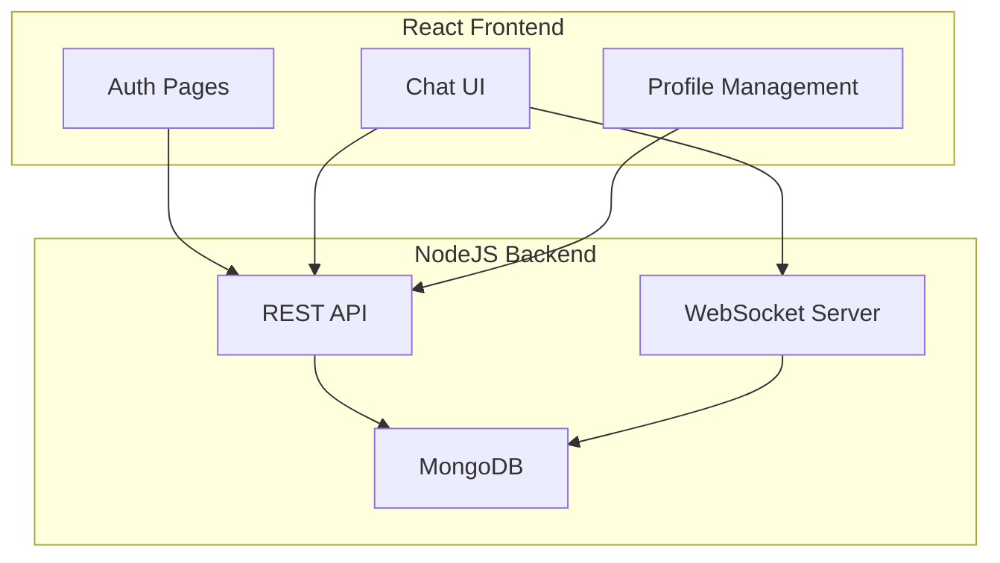

# Fullstack Chat App

## Introduction

Fullstack Chat App is a real-time messaging platform built using the MERN stack. It provides a seamless chat experience through web sockets, supporting one-on-one and group messaging. The application uses robust authentication and maintains chat histories, making it suitable for both personal and professional communication.

## Features

- User authentication with JWT
- Real-time chat via WebSockets (Socket.IO)
- One-on-one and group chat support
- Persistent message histories
- User search functionality
- Profile management
- RESTful API for user, chat, and message operations
- Responsive user interface

## Requirements

- Node.js (v14 or higher)
- npm or yarn
- MongoDB database (local or cloud)
- Modern web browser

## Installation

### 1. Clone the repository

```bash
git clone https://github.com/himanshu427-droid/fullstack-chat-app.git
cd fullstack-chat-app
```

### 2. Install server dependencies

```bash
cd backend
npm install
```

### 3. Set up environment variables

Create a `.env` file in the `backend` directory with the following keys:

```
MONGO_URI=your_mongodb_uri
JWT_SECRET=your_jwt_secret
PORT=5000
```

### 4. Start the backend server

```bash
npm run start
```

### 5. Install client dependencies

In a new terminal window:

```bash
cd frontend
npm install
```

### 6. Start the frontend application

```bash
npm start
```

The frontend will typically run on `http://localhost:3000` and the backend on `http://localhost:5000`.

## Usage

- Register a new account or log in with existing credentials.
- Start new chats by searching for users.
- Create and manage group chats.
- Send and receive messages in real time.
- Manage your profile and view chat histories.

## Architecture Overview

The application is divided into two main parts:

- **Backend**: Node.js + Express server with MongoDB for data persistence. Handles authentication, user management, chat and message routing, and socket communication.
- **Frontend**: React-based user interface, handling authentication, chat UI, and interactions with the backend APIs.

### System Architecture Diagram



## API Endpoints

### User Registration

#### POST /api/user

```api
{
    "title": "User Registration",
    "description": "Register a new user.",
    "method": "POST",
    "baseUrl": "http://localhost:5000",
    "endpoint": "/api/user",
    "headers": [
        {
            "key": "Content-Type",
            "value": "application/json",
            "required": true
        }
    ],
    "bodyType": "json",
    "requestBody": "{\n  \"name\": \"John Doe\",\n  \"email\": \"john@example.com\",\n  \"password\": \"password123\"\n}",
    "responses": {
        "201": {
            "description": "User registered successfully",
            "body": "{\n  \"_id\": \"userId\",\n  \"name\": \"John Doe\",\n  \"email\": \"john@example.com\",\n  \"token\": \"jwt-token\"\n}"
        },
        "400": {
            "description": "User already exists or invalid input",
            "body": "{\n  \"message\": \"User already exists\" \n}"
        }
    }
}
```

### User Login

#### POST /api/user/login

```api
{
    "title": "User Login",
    "description": "Authenticate a user and return a JWT token.",
    "method": "POST",
    "baseUrl": "http://localhost:5000",
    "endpoint": "/api/user/login",
    "headers": [
        {
            "key": "Content-Type",
            "value": "application/json",
            "required": true
        }
    ],
    "bodyType": "json",
    "requestBody": "{\n  \"email\": \"john@example.com\",\n  \"password\": \"password123\"\n}",
    "responses": {
        "200": {
            "description": "User authenticated successfully",
            "body": "{\n  \"_id\": \"userId\",\n  \"name\": \"John Doe\",\n  \"email\": \"john@example.com\",\n  \"token\": \"jwt-token\"\n}"
        },
        "401": {
            "description": "Invalid credentials",
            "body": "{\n  \"message\": \"Invalid email or password\" \n}"
        }
    }
}
```

### Get All Users

#### GET /api/user?search=query

```api
{
    "title": "Get All Users",
    "description": "Retrieve all users matching a search query.",
    "method": "GET",
    "baseUrl": "http://localhost:5000",
    "endpoint": "/api/user",
    "headers": [
        {
            "key": "Authorization",
            "value": "Bearer <token>",
            "required": true
        }
    ],
    "queryParams": [
        {
            "key": "search",
            "value": "Search string for user name or email",
            "required": false
        }
    ],
    "bodyType": "none",
    "responses": {
        "200": {
            "description": "A list of users",
            "body": "[\n  {\n    \"_id\": \"userId\",\n    \"name\": \"Jane Smith\",\n    \"email\": \"jane@example.com\"\n  }\n]"
        }
    }
}
```

### Create Chat

#### POST /api/chat

```api
{
    "title": "Create Chat",
    "description": "Create a new chat (one-on-one or group).",
    "method": "POST",
    "baseUrl": "http://localhost:5000",
    "endpoint": "/api/chat",
    "headers": [
        {
            "key": "Authorization",
            "value": "Bearer <token>",
            "required": true
        },
        {
            "key": "Content-Type",
            "value": "application/json",
            "required": true
        }
    ],
    "bodyType": "json",
    "requestBody": "{\n  \"userId\": \"otherUserId\"\n}",
    "responses": {
        "200": {
            "description": "Chat created or accessed successfully",
            "body": "{\n  \"_id\": \"chatId\",\n  \"users\": [\n    {...}, {...}\n  ],\n  \"isGroupChat\": false\n}"
        }
    }
}
```

### Fetch User Chats

#### GET /api/chat

```api
{
    "title": "Fetch User Chats",
    "description": "Retrieve all chats for the authenticated user.",
    "method": "GET",
    "baseUrl": "http://localhost:5000",
    "endpoint": "/api/chat",
    "headers": [
        {
            "key": "Authorization",
            "value": "Bearer <token>",
            "required": true
        }
    ],
    "bodyType": "none",
    "responses": {
        "200": {
            "description": "List of chats",
            "body": "[\n  {\n    \"_id\": \"chatId\",\n    \"users\": [...],\n    \"isGroupChat\": false\n  }\n]"
        }
    }
}
```

### Send a Message

#### POST /api/message

```api
{
    "title": "Send a Message",
    "description": "Send a message in a chat.",
    "method": "POST",
    "baseUrl": "http://localhost:5000",
    "endpoint": "/api/message",
    "headers": [
        {
            "key": "Authorization",
            "value": "Bearer <token>",
            "required": true
        },
        {
            "key": "Content-Type",
            "value": "application/json",
            "required": true
        }
    ],
    "bodyType": "json",
    "requestBody": "{\n  \"content\": \"Hello!\",\n  \"chatId\": \"chatId\"\n}",
    "responses": {
        "201": {
            "description": "Message sent successfully",
            "body": "{\n  \"_id\": \"messageId\",\n  \"content\": \"Hello!\",\n  \"chat\": \"chatId\",\n  \"sender\": {...}\n}"
        }
    }
}
```

### Fetch Chat Messages

#### GET /api/message/:chatId

```api
{
    "title": "Fetch Chat Messages",
    "description": "Get all messages from a specific chat.",
    "method": "GET",
    "baseUrl": "http://localhost:5000",
    "endpoint": "/api/message/:chatId",
    "headers": [
        {
            "key": "Authorization",
            "value": "Bearer <token>",
            "required": true
        }
    ],
    "pathParams": [
        {
            "key": "chatId",
            "value": "ID of the chat",
            "required": true
        }
    ],
    "bodyType": "none",
    "responses": {
        "200": {
            "description": "List of messages",
            "body": "[\n  {\n    \"_id\": \"messageId\",\n    \"content\": \"Hello!\",\n    \"chat\": \"chatId\",\n    \"sender\": {...}\n  }\n]"
        }
    }
}
```

---

This README provides a comprehensive overview of the Fullstack Chat App, including installation, usage, architecture, and detailed API documentation. For more details, review the repository's code and comments.